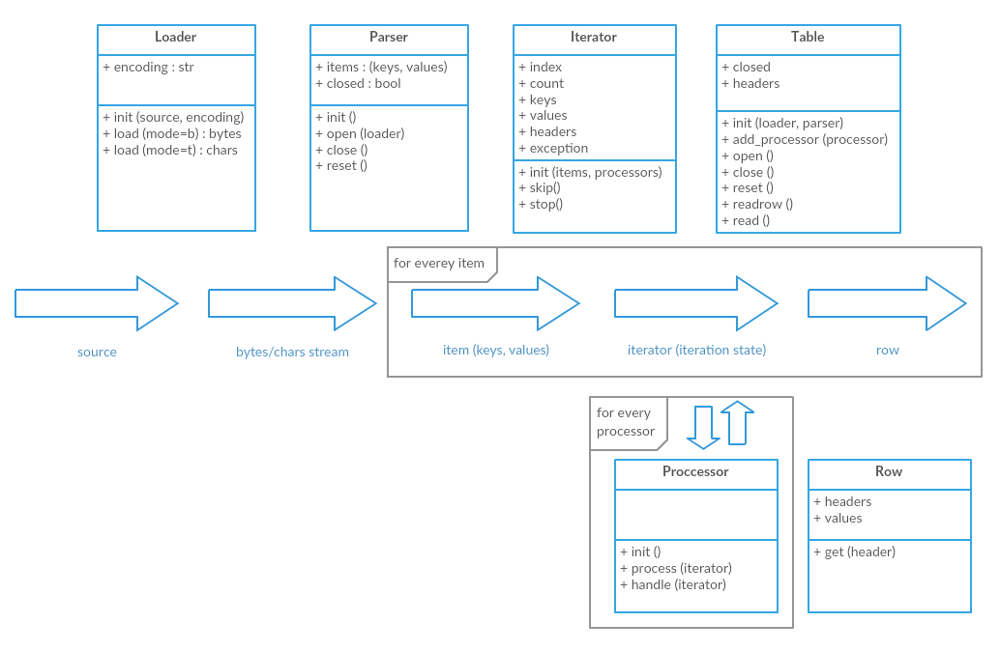

# tabulator-py

[](https://travis-ci.org/datapackages/tabulator-py)
[](https://coveralls.io/r/datapackages/tabulator-py?branch=master)

A utility library that provides a consistent interface for reading tabular data.

## Usage

This section is intended to be used by end-users of the library.

### Getting Started

#### Installation

To get started (under development):

```
$ pip install tabulator
```

#### Simple interface

Fast access to the table with `topen` (stands for `table open`) function:

```python
from tabulator import topen, processors

with topen('path.csv', with_headers=True) as table:
    for row in table:
        print(row)
        print(row.get('header'))
```

For the most use cases `topen` function is enough. It takes the
`source` argument:

```
<scheme>://path/to/file.<format>
```
and uses corresponding `Loader` and `Parser` to open and start to iterate
over the table. Also user can pass `scheme` and `format` explicitly
as function arguments. The last `topen` argument is `encoding` - user can force Tabulator
to use encoding of choice to open the table.

Read more about `topen` - [documentation](https://github.com/datapackages/tabulator-py/blob/master/tabulator/topen.py).

Function `topen` returns `Table` instance. We use context manager
to call `table.open()` on enter and `table.close()` when we exit:
- table can be iterated like file-like object returning row by row
- table can be read row by bow using `readrow` method (it returns row tuple)
- table can be read into memory using `read` function (return list or row tuples)
with `limit` of output rows as parameter.
- headers can be accessed via `headers` property
- table pointer can be set to start via `reset` method.

Read more about `Table` - [documentation](https://github.com/datapackages/tabulator-py/blob/master/tabulator/table.py).

In the example above we use `processors.Headers` to extract headers
from the table (via `with_headers=True` shortcut). Processors is a powerfull
Tabulator concept. Parsed data goes thru pipeline of processors to be updated before
returning as table row.

Read more about `Processor` - [documentation](https://github.com/datapackages/tabulator-py/blob/master/tabulator/processors/api.py).

Read a processors tutorial - [tutorial](https://github.com/datapackages/tabulator-py/blob/master/docs/processors.md).

#### Advanced interface

To get full control over the process you can use more parameters.
Below all parts of Tabulator are presented:

```python
from tabulator import topen, processors, loaders, parsers

table = topen('path.csv',
        loader_options={'encondig': 'utf-8'},
        parser_options={'delimeter': ',', quotechar: '|'},
        loader_class=loaders.File,
        parser_class=parsers.CSV,
        iterator_class=CustomIterator,
        table_class=CustomTable)
table.add_processor(processors.Headers(skip=1))
headers = table.headers
contents = table.read(limit=10)
print(headers, contents)
table.close()
```

Also `Table` class can be instantiated by user (see documentation).
But there is no difference between it and `topen` call with extended
list of parameters except `topen` also calls the `table.open()` method.

### Design Overview

Tabulator uses modular architecture to be fully extensible and flexible.
It uses loosely coupled modules like `Loader`, `Parser` and `Processor`
to provide clear data flow.



### Documentation

API documentation is presented as docstrings:
- High-level:
    - [topen](https://github.com/datapackages/tabulator-py/blob/master/tabulator/topen.py)
- Core elements:
    - [Row](https://github.com/datapackages/tabulator-py/blob/master/tabulator/row.py)
    - [Table](https://github.com/datapackages/tabulator-py/blob/master/tabulator/table.py)
    - [Iterator](https://github.com/datapackages/tabulator-py/blob/master/tabulator/iterator.py)
- Plugin elements:
    - [Loader API](https://github.com/datapackages/tabulator-py/blob/master/tabulator/loaders/api.py)
    - [Parser API](https://github.com/datapackages/tabulator-py/blob/master/tabulator/parsers/api.py)
    - [Processor API](https://github.com/datapackages/tabulator-py/blob/master/tabulator/processors/api.py)

## Development

This section is intended to be used by tech users collaborating
on this project.

### Getting Started

To activate virtual environment, install
dependencies, add pre-commit hook to review and test code
and get `run` command as unified developer interface:

```
$ source activate.sh
```

### Reviewing

The project follow the next style guides:
- [Open Knowledge Coding Standards and Style Guide](https://github.com/okfn/coding-standards)
- [PEP 8 - Style Guide for Python Code](https://www.python.org/dev/peps/pep-0008/)

To check the project against Python style guide:

```
$ run review
```

### Testing

To run tests with coverage check:

```
$ run test
```

Coverage data will be in the `.coverage` file.
